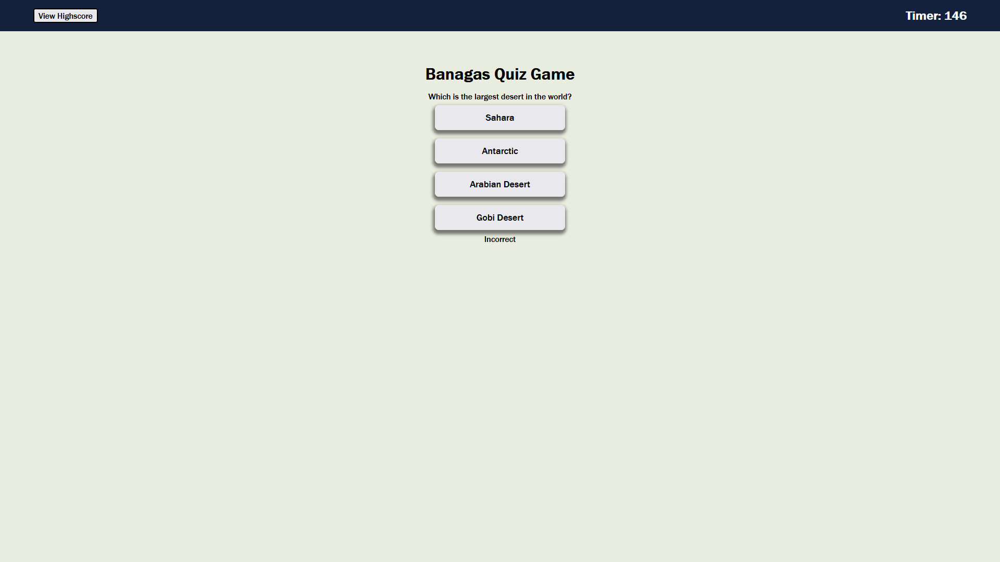

# Quiz Game

https://drew990.github.io/quiz-game/

The map of the world is a powerful tool for shaping how we think about geography and its related concepts. So, it is helpful to test your knowledge on the subject periodically. "Geography Quiz" will not only help you test your knowledge, but also track your score. Quiz was created using JavaScript and HTML5.

# Description

In this project, you'll be able to go through a geography game that will test your knowledge about the world. Besides it from being a quiz game, you will notice that theres only a few HTML components that make up the frontend of displaying it. This is because most of the functions are power by JavaScript. From clicking the start button to showing the first question, to displaying the timer and decreasing time when getting the answer wrong.

## Quiz Function

When clicking start button, a function is called that help sets up the game of where the buttons will be display, and giving the buttons ID's, Values, etc. In order to know what question will be displayed, it pulls the first set of questions from a array that has the options, question text, and the correct answer value. From there, when a button is clicked, it'll get the value that the button is assign and determine if you got the correct answer. If wrong, it'll take 10s off the timer by calling a function. This will repeat until the end. When it reaches the end, you can save your score and can be called anytime you wanna see it. Another function will look in the local storage and will retrieve all keys and values with it

# Author

Andrew Banagas
